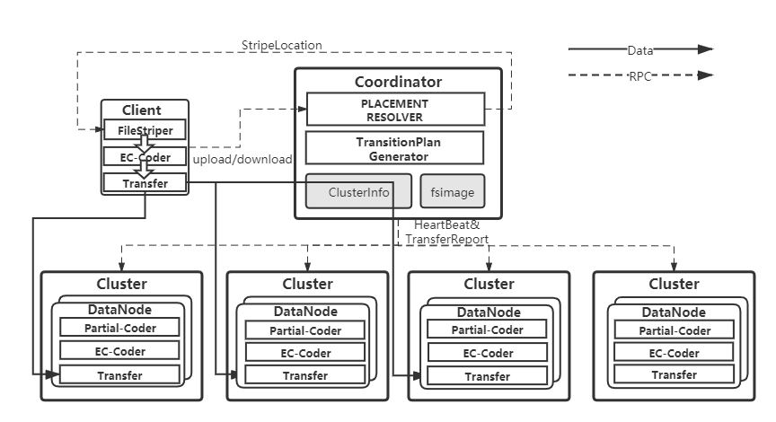

# Overview

This repository is created for Stripe Matching and Merging Algorithms, including the simulation and system implementation(./simulation and ./prototype directory). Our contribution is to propose a matching-and-merging algorithm to improving redundancy transition performance for LRC(Locally-Repairable-Code)-coded data.

Our general stripe-merging transition framework consists of two parts:Adaptive Encoding technique and Data Migration.As for matching, we model the problem that finding the optimal match as a mathematical optimization problem:Minimum Weight Perfect Match in a complete weighted graph.Specifically, We are interested in two special case:1)2 (k-l-g) lrc stripes merging to a (2 * k,2 * l,g) lrc stripe.2)2 (k-l-g) stripes merging to a (2 * k,2 * l,2 * g) lrc stripe.Also,since cross cluster traffic proves to be dominant,we use cross cluster traffic blocks as transition performance metric.For more details,We recommend referring to our papers.

# System Implementation

We implement an erasure coding tiny dfs of about 4000 sloc as testbed and further perform system evalution on it.The architecture follows master-worker style,like many state-of-art distributed file storage suchas HDFS,Ceph.Three major components are client,coordinator,datanode.An example of uploading file can be illustrated as:

Currently,we do not care availabilty issue and just deploy single coordinator,we encourage anyone to perfect the system,for example,you can bring it more availability by adding more CNs and keep them in consistent state by consensus protocol like raft or existed coordinate service like Zookeeper.

Transition process logically looks similar like this.Briefly Speaking,the client sends a rpc to CN which tells CN to start transition.Then,CN generates a transition plan and guides picked DNs to transfer data blocks or complete coding task parallelly.DN actually perform overall blocks sending and receiving.Once DNs complete the task,they send an ack back to CN,so that CN can further modify corresponding meta data and return transition statistics(we use transition duration) to client.We currently focus on two special cases:x=1(g same) and x=2(g double) in experiments. 

User is required to input coding parameter,block size,stripe number and placement policy when start a client to upload stripes.When transition,it asks for transition policy and transition cases(i.e. g same or g double),and finally gets transition duration as result from CN.

Note:We use a physical node to simulate a cluster in productive environment.Similarly,cross cluster bandwidth and inner cluster bandwidth correspond to cross node bandwidth(we deploy system in a LAN) and disk io(SSD in our experiments).

# Requirement

protobuf 3.11.2
grpc v1.28.0-pre3
gf-complete
jerasure
gcc>10(for c++20 support)
ubuntu18.04

# Deployment

cd code/prototype 
mkdir build && cd ./build && cmake ..
make client datanode coordinator 
cp ./client ../
cp ./coordinator ../
cp ./datanode ../ 
cd ../
then run as ./coordinator ./datanode ./client etc.(note datanode should start before coordinator and configuration file in directory ./conf should be modified properly )
